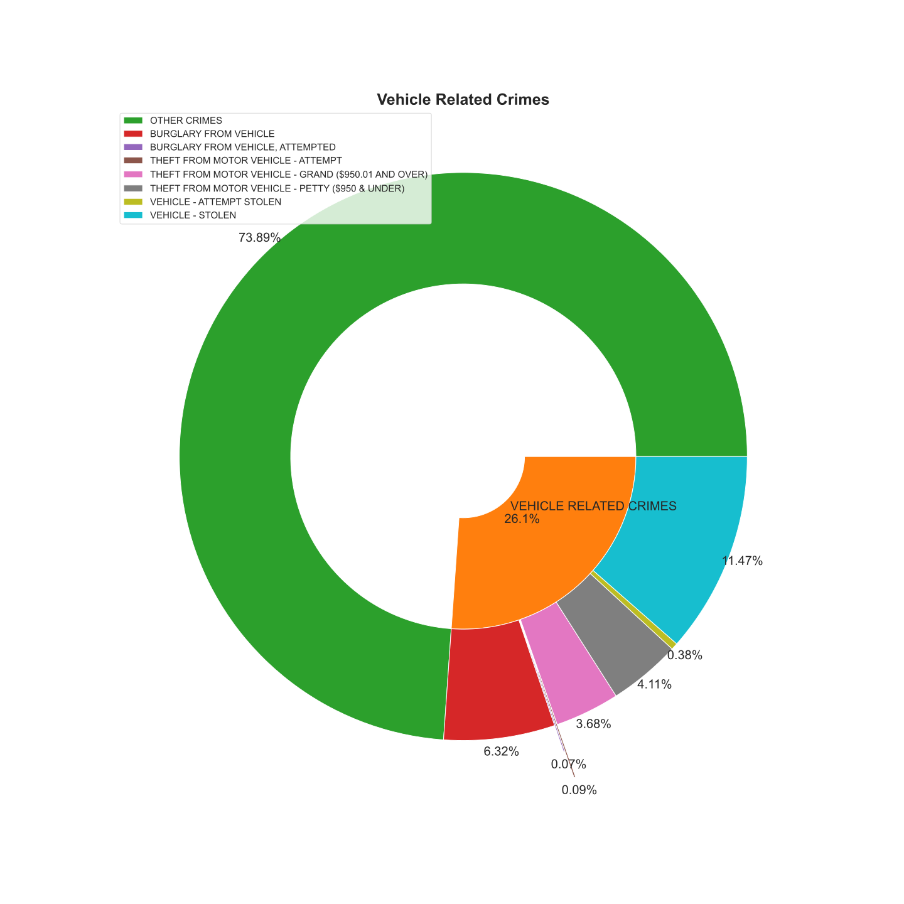
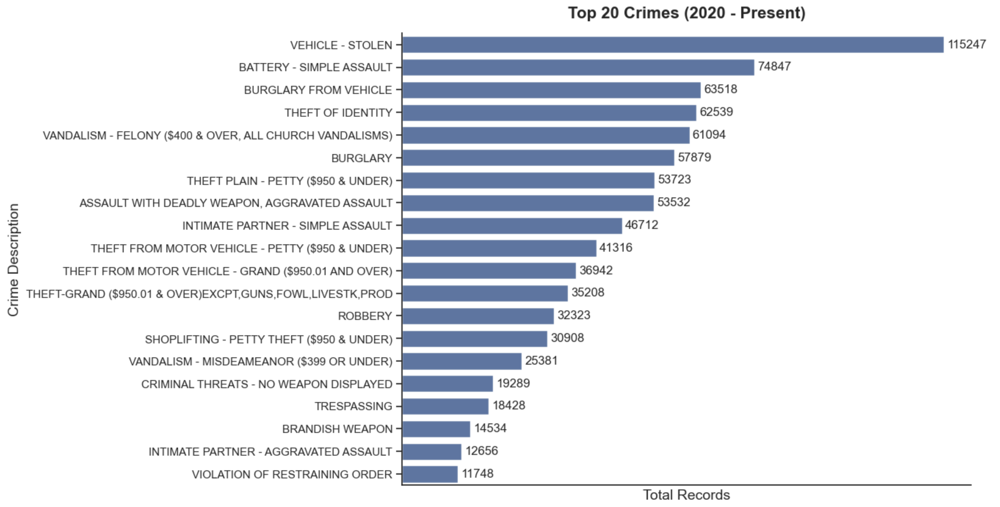
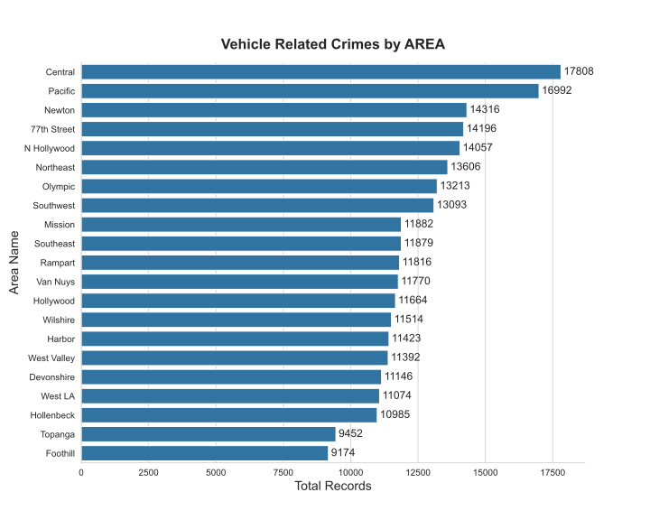
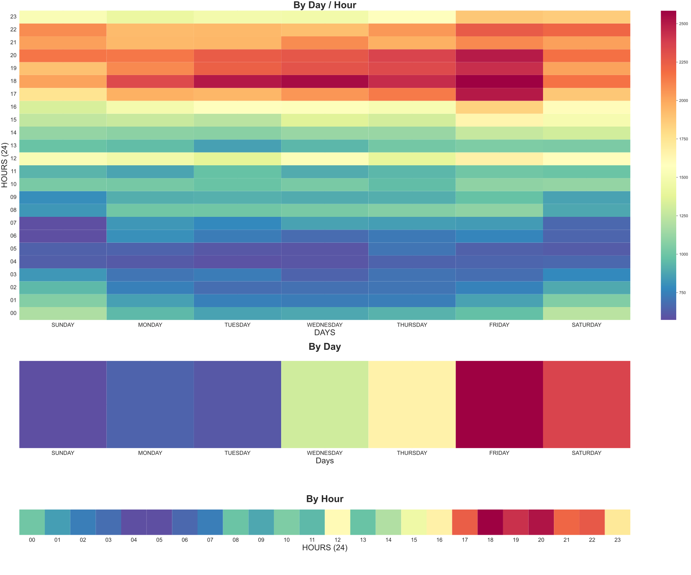
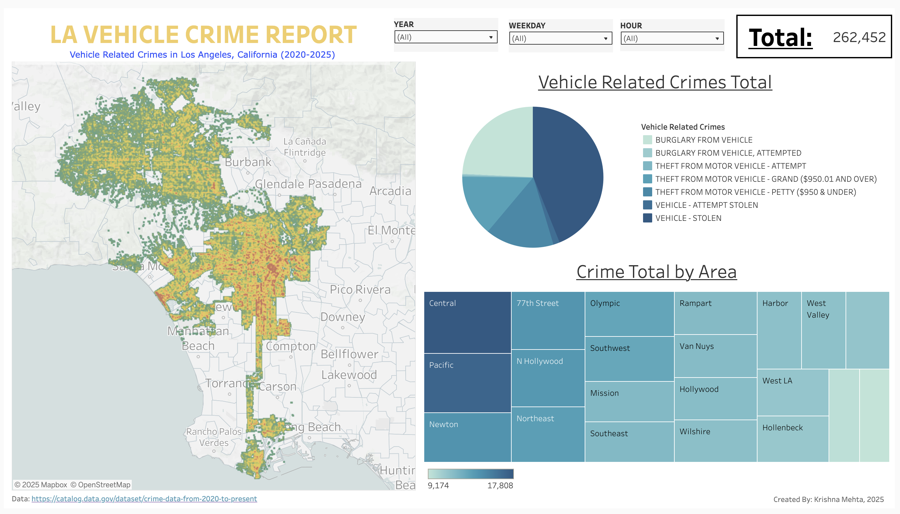

# **LAPD Vehicle Crime EDA**

- Tech Stack: 
	- Python (Pandas, MatPlotLib - Pyplot, Seaborn, Numpy)
	- Tableau
	- Jupyter 
- Data: [LAPD Crime Data 2020 - Present](https://catalog.data.gov/dataset/crime-data-from-2020-to-present)
- Analysis: [Google Colab](https://colab.research.google.com/drive/1xm1F9zblT_s36AuU4-ga8ZRcItl-V62K?usp=sharing) **Data needs to be downloaded*
- Dashboard: [Tableau Public](https://public.tableau.com/views/LAPDCrimeData2020-2025/Dashboard1?:language=en-US&:sid=&:redirect=auth&:display_count=n&:origin=viz_share_link)

## Table of Contents
1. [Overview](#overview )
2. [Data]( #data)
3. [Analysis/Insights](#analysis/insights)
4. [Recommendations](#recommendations)
5. [Dashboard](#dashboard)

# **Overview**

California is ranked one of the top states in the US for vehicle related crimes such as vehicle thefts and burglaries from vehicles. During a recent trip to Los Angeles, California I witnessed a car break in during the day in a highly populated area making me incredibly concerned about my rental car with my belongings parked down the block. In my analysis I aim to answer three questions:

1. **What are vehicle related crimes in Los Angeles?**
2. **How common are vehicle related crimes in Los Angeles?**
3. **Where are the least/most safe areas to park a car?**
4. **What are the least/most safe months, days, and times to leave a car unattended?**

#### Goals: 
My Goals for this project are to learn how too clean, analyze, and visualize real world data using python and various libraries such as Pandas, MatPlotLib - Pyplot, Seaborn, and Numpy as well as learn how to create dashboards using enterprise tools like Tableau.

# **Data**

[Go To Dataset](https://catalog.data.gov/dataset/crime-data-from-2020-to-present)

The Los Angeles Police Department (LAPD) crime data consists of over 1,000,000 entries between the years 2020 and 2025. It follows the FBI's National Incident-Based Reporting System (NIBRS) to collect and record data. Of the 28 attributes in the dataset these are the attributes used:

- **DR_NO:** Unique number identifying each crime 
- **DATE OCC:** Date when the crime occurred 
- **TIME OCC:** Time when the crime occurred 
- **AREA:** A number identifying what area or community the crime occurred 
- **AREA NAME:**  Name of the  area or community the crime occurred 
- **Crm Cd Desc:** Description for the type of crime committed 
- **LAT:** Latitude of the location of incident 
- **LON:** Longitude of the location of incident 

# **Analysis/Insights**

*Detailed EDA can be found [here](https://colab.research.google.com/drive/1xm1F9zblT_s36AuU4-ga8ZRcItl-V62K?usp=sharing) 

## **1. What are vehicle related crimes in Los Angeles?**

There are 7 vehicle related crimes involving a parked motor vehicle, sedans and larger:
- VEHICLE - STOLEN
- BURGLARY FROM VEHICLE
- THEFT FROM MOTOR VEHICLE - PETTY ($950 & UNDER)
- THEFT FROM MOTOR VEHICLE - GRAND ($950.01 AND OVER)
- VEHICLE - ATTEMPT STOLEN
- THEFT FROM MOTOR VEHICLE - ATTEMPT
- BURGLARY FROM VEHICLE, ATTEMPTED

##  **2. How common are vehicle related crimes in Los Angeles?**

### fig. A

*Percentage of vehicle related crimes to all other crimes*

### fig. B

*total top 20 crimes committed between 2020 - Present, by crime*

### **Insights:** 
- **fig. A:**
	- Overall vehicle related crimes make up about 26% of all crimes in LA between 2020 - Present
-  **fig. B :**
	- VEHICLE - STOLEN, BURGLARY FROM VEHICLE, THEFT FROM MOTOR VEHICLE - PETTY ($950 & UNDER), and THEFT FROM MOTOR VEHICLE - GRAND ($950.01 AND OVER) are in the top 20 crimes committed between 2020 - Present with VEHICLE - STOLEN as the #1 committed crime and BURGLARY FROM VEHICLE #3 top crime committed

## **3. Where are the least/most safe areas to park a car?**

*total records of all vehicle related crimes by area (Descending)*

| 5 - Number Summary | Total Records |
| ------------------ | ------------- |
| Minimum Value      | 9, 174        |
| First Quartile     | 11, 392       |
| Median             | 11, 816       |
| Third Quartile     | 13, 606       |
| Maximum Value      | 17, 808       |
*Box plot of total records of all vehicle related crimes by area*

#### **Insights:** 
- Assuming  total records above the third quartile are the least safe and values below the first quartile are the most safe areas to park your car:
	- **Least Safe Areas to Park a Car (Descending):** Central, Pacific, Newton, 77th Street, N Hollywood, Northeast
	- **Most Safe Areas to Park a Car (Descending):** West Valley, Devonshire, West LA, Hollenbeck, Topanga, Foothill

## **4. What are the least/most safe months, days, and hours to leave a car unattended?**

### A. Vehicle Related Crimes - (Daily/ Hourly)

*Total records of vehicle related crimes based on day/hour. Red - high amount, yellow - medium amount, blue - low amount*

### B.  Monthly 
.svg)
*Total records of vehicle related crimes based on month. Red - high amount, yellow - medium amount, blue - low amount*
#### **Insights:** 
- Hourly
	- 12PM and 5-11PM are the LEAST SAFE times to leave a car unattended 
	- 2-7AM and 1-3PM are the MOST SAFE times to leave a car unattended 
- Daily
	- Thursday - Sunday are the LEAST SAFE Days to leave a car unattended, with the most activity between VEHICLE - STOLEN and BURGLARY FROM VEHICLE happen on Saturdays
	-  Mondays are the MOST SAFE day to leave a car unattended  
- Monthly
	- October - January  and July - August are the LEAST SAFE times to leave a car unattended 
	- February - March and July - September  are the MOST SAFE times to leave a car unattended 

# **Recommendation**

Increasing police presence in areas Central, Pacific, Newton, 77th Street, N Hollywood, andNortheast every day around 12PM and Thursday - Saturday between 5 - 11PM could lower vehicle related crimes based on assumptions and observations made from the analytical analysis of Los Angeles, California crime data.

# **Dashboard**

[Go To Dashboard](https://public.tableau.com/views/LAPDCrimeData2020-2025/Dashboard1?:language=en-US&:sid=&:redirect=auth&:display_count=n&:origin=viz_share_link)

The LA Vehicle Crime Report Dashboard delivers insights on the total of each vehicle related crime and total of all vehicle related crime by area. A map is provided to visualize the location of  each recorded crime. Colors on the map represent where the most amount of crime occurs -  highest (red), lowest (green), and everything in between (yellow).

##### **Dashboard Navigation:**
- A dropdown bar at the top of the dashboard allows you to filter by year, weekday, and hour(24).
- You can filter by selecting a crime from the pie chart or an area from the tree map, multiple values can be selected by holding ***ctrl*** while selecting. 
